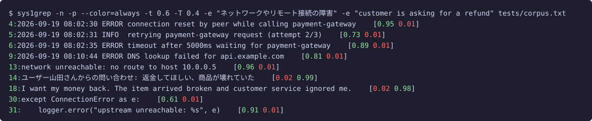

# semgrep — 意味で探す grep

[English version](README.md)

背景と設計の解説: [Jevのキラーアプリ、「意味で探す grep」を作った（Zenn）](https://zenn.dev/uehaj/articles/jev-semgrep-grep-by-meaning)

正規表現ではなく **意味** で行を探す grep です。
判定には [TypeSafe AI](https://typesafe.ai/) の System One モデル **Jev** を使います。
Jev は文章を生成せず、typed な質問に確率だけを返すモデルなので、1 行ごとに
「この行は『ネットワーク障害』の意味に合うか」と聞き、返ってきた確率を閾値で切ります。

```sh
./semgrep -n -e "顧客が怒っている、または不満を持っている" tickets.txt
```

- 依存ゼロ。1 ファイル、Node.js 20.16 以降と `fetch` だけで動きます。
- 速い。30 行を 1 リクエストにまとめ、8 本並列で投げます。210 行のファイルが 1 秒弱で終わります。
- 意味は AND / OR / NOT で自由に組み合わせられます。
- **言語を問わない。** 意味も本文もどの言語でも構いません。日本語の意味でフランス語・ロシア語・中国語・韓国語の行が同じように見つかります。翻訳は挟まず、速度も費用も同じです。

## 言語をまたいで探せる

意味と本文の言語が違っていても構いません。Jev は語ではなく概念を照合するので、
1 つの問い合わせでファイル中のあらゆる言語の行が対象になります。

**英語**の意味で**日本語**の行が見つかります。どの行にも angry / frustrated の語はなく、うち 2 行は日本語です。

```sh
$ ./semgrep -n -e "customer is angry or frustrated" tests/corpus.txt
14:ユーザー山田さんからの問い合わせ: 返金してほしい、商品が壊れていた
16:ユーザー佐藤さんからの問い合わせ: 注文した覚えのない請求が来ています。至急確認してください
18:I want my money back. The item arrived broken and customer service ignored me.
21:Your product ruined my weekend. Never buying from you again.
23:This is the third time I'm writing. Nobody has replied to my previous emails.
```

**日本語**の意味で**英語**の行が、日本語の行と同じ確信度で見つかります。

```sh
$ ./semgrep -n -p -e "返金の要求" tests/corpus.txt
14:ユーザー山田さんからの問い合わせ: 返金してほしい、商品が壊れていた	[0.97]
18:I want my money back. The item arrived broken and customer service ignored me.	[0.95]
```

日英に限った話ではありません。`tests/multi.txt` には仏・露・独・西・中・韓の返金要求と感謝の文が入っています。
日本語の意味 1 つで 6 言語の返金要求がすべて見つかり、ロシア語で書いた意味でも同じ結果になります。

```sh
$ ./semgrep -n -p -e "顧客が返金を求めている" tests/multi.txt
1:Je veux être remboursé, le produit est arrivé cassé.	[0.98]
3:Я требую вернуть деньги, товар не работает.	[0.97]
5:Ich möchte mein Geld zurück, das Gerät ist defekt.	[0.97]
7:Quiero un reembolso, el paquete llegó vacío.	[0.97]
9:我要求退款，商品坏了。	[0.97]
11:환불해 주세요. 제품이 고장났어요.	[0.97]

$ ./semgrep -n -p -e "клиент требует возврат денег" tests/multi.txt
1:Je veux être remboursé, le produit est arrivé cassé.	[0.94]
3:Я требую вернуть деньги, товар не работает.	[0.97]
5:Ich möchte mein Geld zurück, das Gerät ist defekt.	[0.92]
7:Quiero un reembolso, el paquete llegó vacío.	[0.89]
9:我要求退款，商品坏了。	[0.92]
11:환불해 주세요. 제품이 고장났어요.	[0.89]
```

多言語が混ざったログや問い合わせのダンプ、メンバーごとに問い合わせの言語が違うチームで効きます。
注意点が 1 つあります。TypeSafe は英語の精度が最も高いと明記しており、手元の実測でも日本語の意味は
閾値付近でややぶれます。際どい問い合わせは英語で書く方が安定します。

## ベクトル検索と何が違うのか

「X に関係のある行」が欲しいだけなら、埋め込みのコサイン類似度でも同じ行が出ます。違うのは判定の中身です。
semgrep は話題の近さではなく、その行について **命題が成り立つか** を判定します。Jev は行と質問を同時に読んで
答える（cross-encoder 型の）モデルなので、誰が何をしたか、否定、「求めている」のか「済んだ」のかで答えが変わります。
行の埋め込みは質問を見る前に固定されるので、測れるのは話題の近さまでです。

次の 6 行はどれも「返金の話」ですが、顧客が返金を求めているのは 2 行だけです。

```sh
$ ./semgrep -n -p -t 0 -e "customer is asking for a refund" tests/contrast.txt
1:返金してほしい。商品が壊れていた	[0.98]
2:返金処理が完了しましたのでご確認ください	[0.10]
3:当社の返金ポリシーは購入後30日以内です	[0.10]
4:The manager denied the refund request yesterday	[0.17]
5:I demand a full refund immediately	[0.94]
6:Refunds are processed within 5 business days	[0.08]
```

意味ごとに独立した確率が出るので、**論理的な AND と NOT がそのままブール演算になります**。
集合の引き算や「否定クエリ」の工夫は要りません。

```sh
# 返金の話だが、顧客が求めているのではない → 完了報告、ポリシー、却下、日数
$ ./semgrep -n -e "about a refund" -v "the customer is asking for a refund" tests/contrast.txt
2:返金処理が完了しましたのでご確認ください
3:当社の返金ポリシーは購入後30日以内です
4:The manager denied the refund request yesterday
6:Refunds are processed within 5 business days

# 怒っている、かつ、それが顧客であってスタッフではない
$ ./semgrep -n -e "someone is angry" -a "the customer, not the staff, is the one acting" tests/contrast.txt
5:I demand a full refund immediately
8:顧客が怒って電話を切った
```

7 行目の `カスタマーサポート担当者が怒って電話を切った` は、2 つ目の意味で 0.05 となり除外されます。
7 行目と 8 行目のコサイン類似度はほぼ 1 です。

実用上の帰結が 2 つあります。確率は較正されているので閾値 0.5 がどの質問にも使えます。コサイン類似度は
top-k か質問ごとの閾値調整が要ります。また索引を作らず、目の前のファイルにそのまま当てられます。
裏返すと、問い合わせのたびにコーパス全体分を払うので、同じ大きなコーパスに何度も問い合わせるなら
ベクトル索引の方が安くて速いです。

## 正規表現項

`-e`/`-a`/`-v '/pattern/flags'`（先頭と末尾が `/`、フラグは JavaScript のもの）はローカルで判定される
ただの正規表現で、リクエストは一切発生しません。同じ AND 項の絞り込みになり、これが当たった行だけが
その項の意味を尋ねられるので、意味の前に安い正規表現を置くとコストが下がります。行が送られるのは、
どれかの項の正規表現がすべて当たったときだけです（正規表現の無い項はどの行にも当たる扱い）。そのため
`-e '/re/' -a A -e B` では、`re` を含まない行も送られ、`B` だけを尋ねられます。正規表現項だけの式は何も
送りません。ただし `--sentence`（既定の `=jev`）は折り返しの切れ目を Jev に尋ねるので、送らずに済ませたい
ときは `--sentence=rules` を使います。`/…/flags` の形をしていないものは今まで通り意味です。`-e '/etc 以下のファイルを変更している'`
（閉じる `/` が無い）は影響を受けません。本当に `/` で始まり `/` で終わる意味は、正規表現と誤認されない
よう先頭にスペースを置けます。

```sh
$ ./semgrep -e '/ERROR|FATAL/' app.log                               # リクエストなし
$ ./semgrep -e '/timeout/i' -a '顧客に影響が出ている' app.log         # timeout を含む行だけ Jev へ
```

正規表現の名前付き・番号付きグループは、同じ AND 項の他の意味に `$<name>`、`$1`-`$99`、`$&`、`$$` として
渡ります。ECMAScript の置換パターン構文（`String.prototype.replace` の `GetSubstitution`）そのもので、
違いは 1 点だけ: `$<name>` が存在しないグループを指すのは（空文字列ではなく）エラーです（否定した正規
表現のグループを指すのも同様）。`$n` が存在しないグループを指す場合は ECMAScript と同じくそのまま
文字として残るので、`$100 以上の請求` は影響を受けません。

```sh
$ ./semgrep -e '/(?<date>\d{4}-\d\d-\d\d) (?<time>\d\d:\d\d)/' \
            -a '$<time> が深夜（0時〜5時）であり、$<date> が週末である' app.log
#   2026-09-19 03:12 ... → 「03:12 が深夜（0時〜5時）であり、2026-09-19 が週末である」と尋ねる
```

`$<name>` と単一引用符を勧めます。`$<name>` は sh/bash/zsh のダブルクォート内でも生き残りますが、
`$1`、`$time`、`${time}` はシェル自身に展開されてしまいます。`-p` は正規表現項に `1.00`/`0.00` を表示します。

## インストール

使い方は 2 通りあります。コマンドラインツールとして使う（この節）か、Claude Code のスキルとして使う
（後述の [Claude Code から使う](#claude-code-から使う)）か。スキルは `npx @uehaj/semgrep` に自動で切り替わるので、
Claude Code からしか使わないならここでのインストールは不要で、API キーの設定だけで済みます。

Node.js 20.16 以降が必要です。ほかの依存はありません。

```sh
npm install -g @uehaj/semgrep
semgrep --help
```

インストールせずに試すなら `npx` で実行できます（初回だけダウンロードし、2 回目以降はキャッシュから起動します）。

```sh
npx @uehaj/semgrep -n -e "顧客が怒っている、または不満を持っている" tickets.txt
```

次に [TypeSafe のコンソール](https://console.typesafe.ai/) で取得した API キーを渡します。どれか 1 つで構いません。

```sh
export SEMGREP_API_KEY=your-key                       # 環境変数
echo 'SEMGREP_API_KEY=your-key' > ~/.config/semgrep/.env    # ユーザー単位 (先に mkdir -p)
```

環境変数が優先で、足りない分は `~/.config/semgrep/.env` から補います。カレントディレクトリの `.env` は読みません。
clone したばかりのリポジトリのものかもしれず、`SEMGREP_URL` を通じてキーを別のサーバへ送らせ得るからです。
プロジェクト単位の設定は、自分で読み込ませてください: `node --env-file=.env "$(command -v semgrep)" ...`。
`SEMGREP_API_KEY` が無ければ `TYPESAFE_API_KEY` も使えます。

### 既定のオプション

`SEMGREP_OPTS` に書いたオプションは毎回の呼び出しに付きます。読み方は上の設定と同じです。空白で区切って
コマンドラインの前に置くので、コマンドラインが優先します。後に書いた値が効き、`--no-X` で既定のフラグを消せます。

```sh
export SEMGREP_OPTS='--level strict -j 8 -n'
semgrep -e "決済の失敗" app.log                    # strict、8 並列、行番号付き
semgrep --level loose --no-n -e "決済の失敗" app.log
```

semgrep を呼ぶスクリプトもこの既定値を拾います（grep が `GREP_OPTIONS` を廃止した理由です）。スクリプトからは
`SEMGREP_OPTS= semgrep ...` と空にして呼んでください。

### 他のエンドポイント

API の設定は `SEMGREP_API_KEY`（または `TYPESAFE_API_KEY`）、`SEMGREP_URL`、`SEMGREP_MODEL` の 3 つだけです。
TypeSafe の `POST /v1/systemone` と同じ形で話すエンドポイントなら使えます。キーは `SEMGREP_URL` の先へそのまま
送られるので、2 つは組にして設定してください。コマンドラインの `--sys1-model=ID`、`--sys1-url=URL`、`--sys1-api-key=KEY` は
この 3 つより優先します。コマンドラインのキーは `ps` やシェル履歴に残るので、キーはなるべく `~/.config/semgrep/.env` に書いてください。

```sh
# OpenRouter
SEMGREP_URL=https://openrouter.ai/api/v1/systemone SEMGREP_API_KEY=sk-or-... semgrep -e ...
# Vercel AI Gateway
SEMGREP_URL=https://ai-gateway.vercel.sh/typesafe/v1/systemone SEMGREP_MODEL=typesafe-ai/jev SEMGREP_API_KEY=vck_... semgrep -e ...
# キーの要らない互換サーバ: Authorization ヘッダを付けずに送る
SEMGREP_URL=http://localhost:8000/v1/systemone semgrep -e ...
```

集計行には、エンドポイントが返した費用（`usage.cost`）を出します。TypeSafe 本体の場合は定価での推定を `~` 付きで出します。

ソースから使うなら `git clone https://github.com/uehaj/jev-semgrep.git && cd jev-semgrep && npm install -g .`、
またはそのまま `node semgrep.mjs ...` で動きます。

> 静的解析ツールの [Semgrep](https://semgrep.dev/) と同名です。両方使うならどちらかを別名にしてください。

## 例

例はすべて [`tests/corpus.txt`](tests/corpus.txt) に対するものです。サーバログ、日英の問い合わせ、
ソースコード、SQL、雑談が混ざった 51 行のファイルです。

### 概念で探す。言語は問わない

```sh
$ ./semgrep -n -e "customer is angry or frustrated" tests/corpus.txt
14:ユーザー山田さんからの問い合わせ: 返金してほしい、商品が壊れていた
16:ユーザー佐藤さんからの問い合わせ: 注文した覚えのない請求が来ています。至急確認してください
18:I want my money back. The item arrived broken and customer service ignored me.
21:Your product ruined my weekend. Never buying from you again.
23:This is the third time I'm writing. Nobody has replied to my previous emails.
5/51 lines, 2 requests, 3225 input tokens
```

どの行にも「angry」「frustrated」という語はありません。英語の意味で日本語の行も拾えています。

### 問いに答えている行を探す (`-Q`)

`-e` は「その意味が成り立つか」を聞く。`-Q QUESTION` (`--question`) は、その問いに答えている行を探す。
質問している行は意味としては近いが、答えてはいない。Yes/No の問いなら、それを否定する行も答えたことに
なる:

```sh
$ ./semgrep -n -Q "whether the server is down" tests/intent.txt
5:The server is down.
6:The server is healthy and responding normally.
2/17 lines (17 sent), 1 requests, 1087 input tokens, ~$0.000046
```

確認する行も否定する行も、どちらもサーバが落ちているかどうかを解消しているので一致する。`Is the server
down?` は尋ねているだけで答えていないので一致しない。`-Q X` は `-e "the line answers: X"` の略記なので、
`-a` / `-v` / `!` を `-e` と同じように併用でき、他の項とは OR で結ばれる。

### OR で 2 つの意味。`-p` で確率も見る

```sh
$ ./semgrep -n -p -e "返金の要求" -e "配送先の変更依頼" tests/corpus.txt
14:ユーザー山田さんからの問い合わせ: 返金してほしい、商品が壊れていた	[0.97 0.02]
17:ユーザー高橋さんからの問い合わせ: 配送先の住所を変更したいのですが	[0.01 0.96]
18:I want my money back. The item arrived broken and customer service ignored me.	[0.96 0.01]
22:Can I change the delivery address for order #8821?	[0.02 0.96]
4/51 lines, 2 requests, 4602 input tokens
```

末尾の括弧が、指定した順に各意味の確率です。閾値を決めるときの目安になります。

`--color`（端末では既定で有効）を付けると、確率が閾値に対して色分けされます。
`-t` 以上は緑、`-T` 未満は赤、あいだは黄です。行番号とファイル名は grep と同じ配色です。



### AND NOT。ネットワーク障害のうちリトライ中のものを除く

```sh
$ ./semgrep -n -e "ネットワークやリモート接続の障害" -v "a retry is happening or was attempted" tests/corpus.txt
4:2026-09-19 08:02:30 ERROR connection reset by peer while calling payment-gateway
6:2026-09-19 08:02:35 ERROR timeout after 5000ms waiting for payment-gateway
9:2026-09-19 08:10:44 ERROR DNS lookup failed for api.example.com
11:2026-09-19 09:00:00 ERROR SSL handshake failed: certificate expired
13:network unreachable: no route to host 10.0.0.5
30:except ConnectionError as e:
31:    logger.error("upstream unreachable: %s", e)
7/51 lines, 2 requests, 5112 input tokens
```

5 行目の `retrying payment-gateway request (attempt 2/3)` はネットワーク障害ですが、`-v` で落ちています。

### 混合。(金融 AND 悪いニュース) OR 天気

```sh
$ ./semgrep -n -e "about economy, finance or markets" -a "the news is negative or a decline" -e "about weather" tests/corpus.txt
36:今日の天気は晴れ、最高気温は28度です
43:Stock prices fell 3% after the earnings report missed expectations.
48:明日は雨の予報なので傘を持っていきます
3/51 lines, 2 requests, 5673 input tokens
```

`The central bank raised interest rates` は金融の話ですが下落ではないので外れています。

### 厳しさのプリセット

```sh
$ ./semgrep --level strict -n -e "a security risk or dangerous destructive operation" tests/corpus.txt
33:DROP TABLE sessions;
49:API keys must never be committed to the repository.

$ ./semgrep --level loose -n -e "a security risk or dangerous destructive operation" tests/corpus.txt
11:2026-09-19 09:00:00 ERROR SSL handshake failed: certificate expired
16:ユーザー佐藤さんからの問い合わせ: 注文した覚えのない請求が来ています。至急確認してください
33:DROP TABLE sessions;
49:API keys must never be committed to the repository.
```

`strict` はモデルが確信している行だけ、`loose` は期限切れ証明書や身に覚えのない請求まで拾います。

### ディレクトリを再帰検索、ファイル名だけ表示

```sh
$ ./semgrep -r -n -e "customer is asking for a refund" tests/tickets/
tests/tickets/a.txt:7:Ticket #16: I want a refund, the item was broken.
tests/tickets/sub/b.txt:1:The customer wants a refund for the broken lamp.

$ ./semgrep -rl -e "customer is asking for a refund" tests/tickets/
tests/tickets/a.txt
tests/tickets/sub/b.txt
```

`-r` はディレクトリを名前順にたどり、`.git`、`node_modules`、`.ssh`、`.aws`、`.gnupg`、`.kube`、`.docker`、
バイナリ（先頭 8 KB に NUL がある、または PDF。BOM 付きの UTF-16 はテキストとして読む）、
秘密情報になりがちなファイル（`.env*`、`.netrc`、`.npmrc`、`.pypirc`、`.pgpass`、`.git-credentials`、`*.pem`、
`*.key`、`*.p12`、`*.pfx`、`*.jks`、`*.keystore`、`id_rsa*` など。大文字小文字は区別しない）を飛ばします。
**検索対象の行はすべて TypeSafe の API に送られる**ので、スキャンするつもりのディレクトリだけを指定してください。
git リポジトリの中では、git が無視するもの（`.gitignore`、`.git/info/exclude`、グローバルの除外ファイル）も `-r` で
飛ばすので、ビルド成果物や手元だけのファイルは送られません。追跡中のファイルは、無視パターンに当たっても検索します。
コマンドラインで明示したファイルは、除外リストに該当しても、git が無視していても検索します。git が無視している
ディレクトリも、名前を指定すれば検索します（`semgrep -r -e ... dist`）。
`-l` は一致したファイルを見つかった順に 1 回ずつ表示し、`-r` の有無にかかわらず使えます。`-c` は行の代わりにファイルごとの一致行数を出します。

### git のサブコマンドとして (`git semgrep`)

`npm install -g` すると `git-semgrep` も入るので、`git semgrep` で呼べます。`git grep` と同じく git が追跡している
ファイルだけを探し（`.gitignore` 済みのものやビルド成果物は送られない）、FILE はカレントディレクトリからの pathspec です。

```sh
$ cd tests && git semgrep -l -e "customer is asking for a refund" fixture.txt tickets
fixture.txt
tickets/a.txt
tickets/sub/b.txt
```

FILE を省くとカレントディレクトリ以下の追跡ファイルを全部探します。`-r` の除外リスト（`.env*`、鍵など）は追跡されていても適用します。
`--include`、`--exclude`、`--changed-within` は追跡ファイルを絞り込み、pathspec で指定したファイルも対象になります。
`--changed-within` は git の履歴ではなく作業ツリーのファイルの更新時刻を見ます。clone や checkout の直後は、書き出されたファイルがすべて
「いま変わった」扱いになります。
ヘルプは `git semgrep -h` です（`--help` は git が横取りして man ページを探しに行きます）。

### 「〜でない」行を全部

```sh
./semgrep -v "a timestamped server log line" mixed.txt   # grep -v 相当
./semgrep -e "source code or SQL" -v "SQL" src.txt       # コードだが SQL ではない
cat app.log | ./semgrep -e "デプロイが失敗した、またはロールバックされた"
```

### 複数行にまたがるレコード (`-z`)

判定の単位は行です。ログやソースにはそれでよいのですが、1 件のレコードが複数行にまたがるときは合いません。
`-z` を付けると単位が NUL 終端のレコードになります。`grep -z` と同じ意味なので、レコードを出力するツールと
そのまま繋がります。`git log -z`、`find -print0`、`xargs -0` などです。

「このコミットはユーザーに見える振る舞いを変えている」という命題は、コミット全体について成り立つもので、
その中のどの 1 行についてでもありません。

```sh
$ git log -z --format='%h %s %b' | ./semgrep -z -n -e "ユーザーに見える振る舞いを変えている" -v "ドキュメントだけの変更"
7:21120e9 Revert "feat: ship the /semgrep Claude Code skill" ...
8:51ae333 feat: ship the /semgrep Claude Code skill
```

一致したレコードも NUL 終端で出力されるので、読むときは `tr '\0' '\n'` に通してください。
ファイル名 (`-l`) と件数 (`-c`) は grep と同じく改行のままです。`-z` のとき `-n` はレコード番号、
`-A` / `-B` / `-C` は前後のレコード数、`--chunk` は 1 リクエストのレコード数を数えます。

### 1 文ずつ判定する (`--sentence`)

`--sentence` を付けると、行ではなく文ごとに判定します。出力は grep と同じく行のままです。当たった文がかかる
行をすべて出し、端末では文の部分を grep の一致の色で強調します。文に分ける前に折り返した行をつなぐので、
複数行にまたがる文も 1 文として判定します。[`tests/prose.txt`](tests/prose.txt) には、折り返した英語と日本語の
段落が入っています。

```sh
$ ./semgrep -n --sentence -e "the author admits they made a mistake" tests/prose.txt
1:I should have checked the input
2:before shipping, and that was my
3:mistake. Next time I will add a test
```

文は 1 行目から始まり、3 行目の `mistake.` で終わります。色が付くのはその部分だけで、
`Next time I will add a test` は別の文として判定され、一致しません。

`-o` を付けると、当たった文だけを 1 行ずつ出します。`grep -o` が一致した部分だけを出すのと同じです。
`-n` は文が始まる行の番号になります。日本語は空白を入れずにつなぎます。単語の間に空白を置かない
中国語・タイ語・ラオ語・クメール語・ミャンマー語・チベット語も同様です。

```sh
$ ./semgrep -n -o --sentence -e "the author admits they made a mistake" -e "customer is asking for a refund" tests/prose.txt
1:I should have checked the input before shipping, and that was my mistake.
8:先週買った掃除機が初日から動かないので返金してほしいです。
```

`-o` なしでは、`-c` と `-A` / `-B` / `-C` はいつもどおり行で数えます。`-o` 付きでは文で数えます。
`-z` と併用すると、レコードごとに文に分け、当たったレコードをまるごと出します。

Jev は長い行の中からでも当たる文を自分で見つけるので、判定の精度のために `--sentence` を使う必要はありません。
どの文が当たったかを見たいとき、`-o` で文そのものが欲しいとき、AND を 1 つの文の中で成り立たせたいときに
使います。式は文ごとに評価されます。そのため、`-v X` だけの式では「X でない文を 1 つでも含む行」がすべて出ます。
行全体として X でないものを探すなら、`--sentence` を付けずに使います。

日本語や中国語では、チャットの発言、問い合わせ、メモの 1 行など、`。` で終わらない 1 行 1 件のデータがよくあります。
これをつなぐと、別々の項目が 1 つの「文」になってしまいます。そこで既定（`--sentence`、`--sentence=jev` と同じ）では、
単語の間に空白を置かない文字に接する、句点の無い改行について、Jev に「この改行は文や項目の終わりか、文の途中の
折り返しか」を聞きます。30 行を 1 リクエストにまとめて改行ごとに yes/no を聞き、0.7 以上なら行をつなぎません。
[`tests/corpus.txt`](tests/corpus.txt) では、これで日本語の問い合わせ 4 件が 1 件ずつに分かれ、`--sentence` でも
行単位の検索と同じ返金の要求（14 行目と 18 行目）が見つかります。規則だけでは問い合わせがつながり、18 行目を
取りこぼしていました。追加のリクエストの費用は、意味を 1 つ増やすのと同じくらいです。避けたいときは
`--sentence=rules` を使います。英語どうしの改行は聞きません。つないでも空白が残り、ピリオドで文が切れるためです。

改行が文の途中になりえないところでは、行をつなぎません。空行、括弧や `;` に接する改行（JSON やコード）、
`-` `*` `+` `#` `>` `"` や数字で始まる行（箇条書き、見出し、引用、番号、日時）の前です。そのため JSONL は
1 行 1 レコードのまま、行ごとに文に分けられます。文の区切りには `Intl.Segmenter`
（[Unicode UAX #29](https://unicode.org/reports/tr29/)）を使います。`.` `!` `?` `。` `！` `？` で切り、
`Mr.` のような略語の後ろでも切ります。ログは文章ではないので、`ERROR ...` の次の `WARN ...` のように
英字で始まるログ行が続くと、つながります。

### テンプレートごとに 1 行だけ判定する (`--dedup`)

費用は送るテキストの量に比例します。機械が吐くログの大半は、ID や数値だけが違う同じ骨格の繰り返しです。
`--dedup` は ID・ハッシュ・数値・日付と時刻・パス・URL をマスクして行をまとめ、グループごとに 1 行だけ送って、
その答えを残りの行にも使います。送るのはその行の原文で、出力も各行がそのまま出ます。

```sh
$ ./semgrep --dedup -n -e "a request failed" app.log
1:worker request 3fa9c1e27b failed: connection reset
2:worker request 88d0e41a5c failed: connection reset
4:worker request 0b7f2a9e13 failed: connection reset
3/6 lines (4 sent of 6), 2 requests, 907 input tokens, ~$0.000038
```

どの値をまとめてよいかは意味によります。「ディスク使用率が 90% を超えている」なら数値が、「夜間に起きた」なら
時刻が答えを決めます。そこで先に、意味ごとに小さなリクエストを 1 つ送って、どの種類の値が判定を変えうるかを
Jev に聞き、その種類はまとめません（上の 2 リクエストのうち 1 つ）。同じファイルに
`-e "disk usage is above 90%"` で聞くと、`95%` と `12%` は別々に判定され、`5:disk usage 95%` だけが出ます。

値を何も残さずにまとめた場合の実測では、43,071 行のシステムログが 550 テンプレート（バイト数で 1.2%）に、
`install.log` が 21.1% に縮みました。Claude Code のトランスクリプト（jsonl）は 56.8% までしか縮みません。
機械が吐くログ向けの機能で、散文には共通の骨格がなく、時刻を読む意味ではほとんど縮みません。
`-z` や `--sentence` では、行ではなくレコードや文をまとめます。

手元のログがどこまで縮むかは、検索の費用を払う前に `node scripts/dedup-measure.mjs FILE...` で確かめられます。
同じマスクを使い、API を呼ばずに行数・テンプレート数・送るバイト数の割合を数えます。`--keep=num,time` を
付けると、その種類を残す意味の場合を見られます。

同じリクエストの他の行は各行の文脈になり（#9）、`--dedup` はそれを変えます。そのため閾値に近い行は、
全行を送ったときと判定が変わることがあります。

## Claude Code から使う

semgrep を代わりに走らせてくれる Claude Code のスキルがあります。探したいものを言葉で書くと、式を組み立てて
検索し、`file:line` 付きで該当行を報告します。[`uehaj/uehaj-marketplace`](https://github.com/uehaj/uehaj-marketplace) マーケットプレースの
`uehaj` プラグインとして公開しています。

```sh
claude plugin marketplace add uehaj/uehaj-marketplace
claude plugin install uehaj@uehaj-marketplace
```

コマンドラインツールを別途インストールする必要はありません。スキルは PATH に `semgrep` があればそれを、
無ければ `npx @uehaj/semgrep` を使います。必要なのは API キーの設定だけです（[インストール](#インストール) を参照）。

あとは Claude Code の中で次のように打ちます。

```
/uehaj:semgrep 返金を求めている問い合わせ tickets/*.txt
/uehaj:semgrep 未テストのまま入った修正 git log --oneline -200
```

Claude Code のインストール単位はプラグインで、スキル単体は選べません。このスキルだけ欲しいときは
[skills CLI](https://skills.sh/) が `~/.claude/skills/` にコピーしてくれ、その場合は `/semgrep` で呼びます。

```sh
npx skills add uehaj/uehaj-marketplace --skill semgrep -a claude-code -g
```

スキルは意味を英語で書き、AND / OR / NOT を `-e` / `-a` / `-v` に振り分け、`-n` を付け、大きなディレクトリは
課金に見合うファイルに絞り、最初の結果が怪しければ `--level loose` や `strict` で引き直します。
API キーとエンドポイントの読み方はコマンドラインと同じです（`SEMGREP_API_KEY`、`~/.config/semgrep/.env`）。

## 使い方

```
usage: semgrep [OPTION]... -e MEANING|-Q QUESTION [-a MEANING] [-v MEANING]... [FILE...]

  -e MEANING   この意味に合う行 (複数指定は OR)
  -Q, --question QUESTION  QUESTION に答えている行 (尋ねている行ではない)。-e "the line answers: QUESTION"
               と同じ (上の「問いに答えている行を探す」参照)
  -a MEANING   直前の -e/-Q 項に AND で連結。-e A -a B -e C は (A and B) or C
  -v MEANING   直前の -e/-Q 項に AND NOT で連結。-e A -v B は A and not B
               先頭に置けば単独の否定。-v B は not B (grep -v 相当)
  !MEANING     -e / -Q / -a / -v のどこでも、先頭に ! を付けるとその意味だけ否定
               -e A -e '!B' は A or not B。-a '!C' は -v C と同じ
  --level=LEVEL 厳しさ。肯定と否定の閾値をまとめて決める (既定 normal)
                 loose  : -t 0.3 -T 0.7  多少あやしくても拾う
                 normal : -t 0.5 -T 0.5
                 strict : -t 0.7 -T 0.3  確信のある行だけ拾う
  -t THRESH    肯定条件の閾値。確率 >= THRESH で一致 (--level より優先)
  -T THRESH    否定条件の閾値。確率 < THRESH で「〜でない」と判定 (--level より優先)
               -t 0.6 -T 0.3 なら 0.3〜0.6 の曖昧な行はどちらにも当たらない
  -r           ディレクトリを再帰的に探す (FILE 省略時はカレント)。.git、node_modules、
               バイナリ、秘密情報らしいファイル、git が無視するものは飛ばす
  --include=GLOB, --exclude=GLOB  -r と git semgrep で、名前が GLOB に合うファイルだけ (または合わないものだけ) を探す
               (-r ではコマンドラインで指定したファイルは必ず探す。git semgrep の pathspec は絞り込む)
  --changed-within=WHEN  -r と git semgrep で、30m / 2h / 7d / 2w 以内、日付か日時以降、today / this-week /
               this-month に更新したファイルだけを探す
  -l           一致した行ではなくファイル名だけを表示
  -A NUM       一致行の後ろ NUM 行も表示 (grep と同じ。文脈行の区切りは - )
  -B NUM       一致行の前 NUM 行も表示
  -C NUM       前後 NUM 行を表示 (-A NUM -B NUM)
  -c           一致した行数だけをファイルごとに表示 (grep -c 相当)
  -q, --quiet  何も表示せず、最初の一致で止まる。一致があればエラーがあっても終了コード 0 (grep -q 相当)
  --chunk=LINES 1 リクエストにまとめる行数 (既定 30)
               同じリクエストの行は互いの文脈になるので、小さくすると速さだけでなく曖昧な行の
               判定も変わる
  -j N         同時リクエスト数 (既定 8)
  -n           行番号を付ける
  -z, --null-data  行ではなく NUL 終端のレコードごとに判定し、NUL 終端で出力する (前述の「複数行にまたがるレコード」を参照)
  --sentence[=HOW] 行ではなく文ごとに判定する。HOW は jev (既定) か rules (前述の「1 文ずつ判定する」を参照)
  -o           --sentence と併用し、当たった文だけを出す
  -p           各意味の確率を行末に表示 (閾値調整用)
  --dry-run    何も送らず、送信先・検索するファイル・各リクエストとその質問を表示
  --verbose    同じ表示を検索しながら stderr に出す
  -i, --interactive  --dry-run と同じ内容を見せ、端末で y と答えたときだけ検索する
  --dedup      テンプレートごとに 1 行だけ判定し、その答えを残りにも使う (前述の「テンプレートごとに 1 行だけ判定する」を参照)
  --color[=WHEN] 色付け。auto (端末なら付ける、既定) / always / never。=WHEN 省略時は auto
               ファイル名・行番号は grep と同じ配色。-p の確率は閾値以上を緑、
               否定側の閾値未満を赤、あいだを黄で表示。NO_COLOR にも従う
  --sys1-model=ID, --sys1-url=URL, --sys1-api-key=KEY
               API の設定。SEMGREP_MODEL / SEMGREP_URL / SEMGREP_API_KEY より優先
  -h, --help   このヘルプ (LANG / LC_ALL / LC_MESSAGES が ja 以外なら英語)
  -V, --version  バージョンを表示して終了
```

FILE を省略すると stdin を読みます。複数ファイルなら `file:` を前置きします。
終了コードは grep と同じで、一致あり 0、なし 1、エラー 2（引数エラー、読めないファイル、API 障害）です。

### 式の書き方

`-e` が OR の項を始め、`-a` / `-v` は直前の項に AND / AND NOT で連結します。
意味の先頭に `!` を付けるとその意味だけを否定できます（シェルの履歴展開を避けるためシングルクォートで囲んでください）。

| コマンド | 意味 |
|---|---|
| `-e A -e B` | A or B |
| `-e A -a B` | A and B |
| `-e A -v B` | A and not B |
| `-e A -a B -v C -e D` | (A and B and not C) or D |
| `-e A -e '!B'` | A or not B |
| `-v B` | not B |

## 仕組み

1. 空行を除いた行を 30 行ずつ（文字数上限つき）のチャンクに分ける
2. チャンクを `{"L000": "行1", "L001": "行2", ...}` という object として `state` に入れ、
   行 × 意味 の数だけ `noul`（yes/no 確率）質問を 1 リクエストにまとめて送る
3. 8 本まで並列にリクエストし、結果はファイル順に出力する
4. 各行について、意味ごとの確率を閾値で真偽に変え、AND / OR / NOT の式を評価する

一緒に送った行は互いの文脈になります。Jev はチャンクのほかの行から、そのファイルで何が普通かを読み取って
判定します。はっきり当たる行・当たらない行は動きませんが、曖昧な行は動きます。チャンクの区切りの位置は
ほとんど効きません（あるログの 200 行で、`--chunk 30` の区切りを 15 行ずらして反転したのは 1 行）。効くのは
周りの行が少ない状態で判定することで、`--chunk 1` では同じ 200 行のうち 18 行が反転し、しかも単独での判定の
方が当てになりませんでした（#9）。つまり `--chunk` は速さだけでなく結果も変えます。入力がごく短いときは
`--chunk` に関係なく文脈の少ない判定になります。1 行ずつは遅くもあります（30 行で 1 リクエスト約 0.2 秒、
1 行ずつだと約 7 秒）。チャンクを大きくしすぎると閾値付近の行が落ちやすくなるので既定は 30 行です。
確率は実行ごとに ±0.05 ほどぶれます。閾値を詰めるときは `-p` で確率を見てください。

料金は入力 100 万トークンあたり 0.042 ドル（2026 年 9 月時点）で、2 つの意味で 30 行のチャンクが
約 3,000 トークンです。上限はレート制限（1,200 リクエスト/分）で決まり、既定設定なら毎分およそ
36,000 行です。

## テスト

`tests/` に LLM-as-judge のテストがあります。`tests/corpus.txt`（51 行）に対して `tests/cases.json` の
10 ケースを実行し、Claude（`claude -p`）が「各意味に本当に合致する行」を判定した結果と突き合わせて
precision / recall を出します。あわせて `-t` × `-T` を 0.05 刻みで総当たりし、最良の閾値を報告します。

```sh
node --no-warnings tests/judge.mts [--model sonnet] [--rejudge]
```

ジャッジの判定は `tests/verdicts.json` にキャッシュされ、2 回目以降はジャッジを呼びません。
結果は `tests/report.md` に書き出されます。直近の結果は precision 0.94、recall 0.98 です。

## 制約

- 検索した行はすべて api.typesafe.ai に送られます。そこにアップロードしたくないファイルには使わないでください。
- 空行は送らず、全意味の確率 0 として扱います。`-v X` には当たり、`-e X` には当たりません。
- 1 行は 2,000 文字で切って送ります。
- 1 リクエストの質問数上限は公式に書かれていませんが、420 質問は通っています。
- 429 / 529 は指数バックオフで 6 回まで再試行します。
- 精度は英語がもっとも高く、日本語も使えますがぶれは大きめです。

## よくある質問

semgrep の前に標準のコマンドを置けば済むので、本体に入れなかったオプションがあります。その組み合わせ方です。

### 段落をまるごと 1 単位として判定したい。`--paragraph` はないのか

先に段落を 1 行にまとめてから渡します。`fmt` は段落の中の行をつなぎ、段落の間の空行は残します。

```sh
fmt -w 100000 essay.txt | semgrep -n -e "the author admits they made a mistake"
```

出力の 1 行が 1 段落になり、`-n` は元のファイルではなく `fmt` の出力の行番号になります。`fmt` は日本語の行をつなぐとき
間に空白を入れますが、Jev の判定には響きません。折り返しをまたぐ文を判定したいだけなら、どちらも要りません。
`--sentence` が行をつないで文に分けます。

### 会話記録の JSONL を、発言 1 件ずつ判定したい

`jq` で本文を取り出し、発言ごとに NUL で終えてから、`-z` でレコードとして判定します。

```sh
jq -j '.content + "\u0000"' chat.jsonl | semgrep -z -n --sentence -e "the customer is asking for a refund" | tr '\0' '\n'
```

`.content` は、本文が入っている場所に合わせて書き換えてください。発言 1 件が 1 レコードになるので、文が次の話者の
発言とつながらず、JSON の記号も送られません。`-n` は発言の番号です。1 行に 1 つの JSON が並んだファイルは
そのままでも扱えます。`jq` を通すと単位がきれいになる、というだけです。

### レコードの区切りが NUL ではない。`--record-separator` はないのか

区切りを NUL に置き換えて `-z` を使います。`----` の行で区切られたレコードなら次のとおりです。

```sh
perl -0777 -pe 's/\n----\n/\0/g' notes.txt | semgrep -z -e "a decision was made" | tr '\0' '\n'
awk '/^----$/ { printf "%c", 0; next } { print }' notes.txt | semgrep -z -e "a decision was made" | tr '\0' '\n'
```

`git log -z`、`find -print0`、`xargs -0` はもともと NUL で区切るので、`-z` でそのまま扱えます (#6)。
任意の区切り文字を受け付けると、エスケープ、マルチバイト、正規表現か文字列か、という問題を抱え込みます。
`perl` か `awk` の 1 行で済むことのために、それは割に合いません。`awk` の書き方は、複数文字の `RS` を
受け付けない macOS の BSD awk でも動きます。

## ライセンス

MIT
