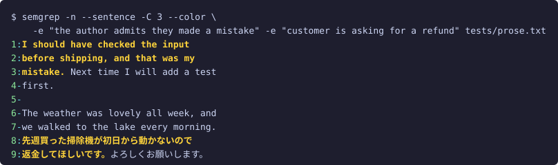

# semgrep — grep by meaning

[日本語版はこちら](README.ja.md)

Background and design notes (Japanese): [Jevのキラーアプリ、「意味で探す grep」を作った](https://zenn.dev/uehaj/articles/jev-semgrep-grep-by-meaning) on Zenn.

A grep that finds lines by **what they mean**, not by regular expressions.
Matching is done by **Jev**, the System One model from [TypeSafe AI](https://typesafe.ai/).
Jev does not generate text. It answers typed questions with probabilities, so for every line
semgrep asks "does this line match the meaning *network failure*?", gets a probability back,
and applies a threshold.

```sh
./semgrep -n -e "customer is angry or frustrated" tickets.txt
```

[](https://uehaj.github.io/jev-semgrep/)

<sub>▶ Click the demo, or open <a href="https://uehaj.github.io/jev-semgrep/">uehaj.github.io/jev-semgrep</a>, for the full demo on the landing page.</sub>

- Zero dependencies. One file, Node.js 20.16+ and `fetch`.
- Fast. 30 lines go into one request, requests run 8 at a time. A 210-line file finishes in under a second.
- Meanings combine with AND / OR / NOT.
- **Language-agnostic.** The meaning and the text can each be in any language. A Japanese meaning finds French, Russian, Chinese and Korean lines alike. No translation step, same speed, same cost.

## Search across languages

The meaning and the text do not have to share a language. Jev compares concepts, not words,
so one query finds matching lines in every language the file contains.

An **English** meaning finds **Japanese** lines. None of the hits contain "angry" or "frustrated", and two of them are in Japanese:

```sh
$ ./semgrep -n -e "customer is angry or frustrated" tests/corpus.txt
14:ユーザー山田さんからの問い合わせ: 返金してほしい、商品が壊れていた
16:ユーザー佐藤さんからの問い合わせ: 注文した覚えのない請求が来ています。至急確認してください
18:I want my money back. The item arrived broken and customer service ignored me.
21:Your product ruined my weekend. Never buying from you again.
23:This is the third time I'm writing. Nobody has replied to my previous emails.
```

A **Japanese** meaning finds **English** lines, with the same confidence as the Japanese ones:

```sh
$ ./semgrep -n -p -e "返金の要求" tests/corpus.txt
14:ユーザー山田さんからの問い合わせ: 返金してほしい、商品が壊れていた	[0.97]
18:I want my money back. The item arrived broken and customer service ignored me.	[0.95]
```

It is not a Japanese/English feature. `tests/multi.txt` holds refund requests and thank-you notes in French,
Russian, German, Spanish, Chinese and Korean. One Japanese meaning finds all six refund requests; a Russian
meaning does the same:

```sh
$ ./semgrep -n -p -e "顧客が返金を求めている" tests/multi.txt
1:Je veux être remboursé, le produit est arrivé cassé.	[0.98]
3:Я требую вернуть деньги, товар не работает.	[0.97]
5:Ich möchte mein Geld zurück, das Gerät ist defekt.	[0.97]
7:Quiero un reembolso, el paquete llegó vacío.	[0.97]
9:我要求退款，商品坏了。	[0.97]
11:환불해 주세요. 제품이 고장났어요.	[0.97]

$ ./semgrep -n -p -e "клиент требует возврат денег" tests/multi.txt
1:Je veux être remboursé, le produit est arrivé cassé.	[0.94]
3:Я требую вернуть деньги, товар не работает.	[0.97]
5:Ich möchte mein Geld zurück, das Gerät ist defekt.	[0.92]
7:Quiero un reembolso, el paquete llegó vacío.	[0.89]
9:我要求退款，商品坏了。	[0.92]
11:환불해 주세요. 제품이 고장났어요.	[0.89]
```

This makes semgrep useful for mixed-language logs and ticket dumps, and for teams whose members
query in different languages. One caveat: TypeSafe documents English as the most accurate language,
and in our tests Japanese meanings wobble a little more near the threshold. When a query is borderline,
phrasing the meaning in English is the safer choice.

## How this differs from vector search

If all you want is "lines about X", embedding similarity gives you the same lines. semgrep differs in
*what* it judges: not how close a line is to a topic, but whether a **proposition** holds for that line.
Jev reads the line and the question together (a cross-encoder shape), so who did what, negation, and
"asked for" versus "already done" all change the answer. An embedding of the line is fixed before it
ever sees your query, so it can only measure topical closeness.

All eight lines below are "about a refund" (the same contrast as `tests/contrast.txt`, translated to
English as `tests/contrast.en.txt` — see [Search across languages](#search-across-languages) above for
the case where the meaning and the text differ in language). Only two are a customer asking for one:

```sh
$ ./semgrep -n -p -t 0 -e "customer is asking for a refund" tests/contrast.en.txt
1:I want a refund. The item was broken.	[0.99]
2:The refund has been processed. Please check your account.	[0.11]
3:Our refund policy is within 30 days of purchase.	[0.09]
4:The manager denied the refund request yesterday	[0.17]
5:I demand a full refund immediately	[0.93]
6:Refunds are processed within 5 business days	[0.07]
7:The support agent got angry and hung up the phone.	[0.05]
8:The customer got angry and hung up the phone.	[0.06]
```

Because each meaning yields an independent probability, **logical AND and NOT are plain boolean
operations**, not a trick with set differences or "negative queries":

```sh
# about a refund, but NOT a customer asking for one → completed, policy, denied, timelines
$ ./semgrep -n -e "about a refund" -v "the customer is asking for a refund" tests/contrast.en.txt
2:The refund has been processed. Please check your account.
3:Our refund policy is within 30 days of purchase.
4:The manager denied the refund request yesterday
6:Refunds are processed within 5 business days

# angry AND it is the customer, not the staff
$ ./semgrep -n -e "someone is angry" -a "the customer, not the staff, is the one acting" tests/contrast.en.txt
5:I demand a full refund immediately
8:The customer got angry and hung up the phone.
```

Line 7, `The support agent got angry and hung up the phone.`, scores 0.05 on the second meaning and is
excluded, even though it differs from line 8 by one word (*support agent* vs. *customer*) — wording an
embedding would place right next to line 8's. (We could not reproduce a cosine-similarity number for
this pair: no embedding-model access was available in this environment, and no prior measurement script
exists in the repository or its history to rerun. The argument stands on the wording alone: an embedding
of line 7 has no way to see that "support agent" changes who the sentence is about.)

Two more practical consequences. The probabilities are calibrated, so one threshold (0.5) works across
queries, where cosine scores need top-k or per-query tuning. And there is no index to build: semgrep reads
the files in front of you. The flip side is that every query pays for the whole corpus again, so for
repeated queries over a large, fixed corpus a vector index is cheaper and faster.

## Regex terms

`-e`/`-a`/`-v '/pattern/flags'` (first and last character `/`, JavaScript flags) is matched locally,
as a plain regex, with no request at all. It prefilters its AND term: only the lines it holds for
ever ask that term's meanings, so a cheap regex in front of a meaning cuts both the bill and the wait. A line is sent
only if some term's regexes all hold for it (a term with no regex holds for every line), so with
`-e '/re/' -a A -e B` a line without `re` is still sent, asked `B` only. A query of regex terms alone
sends nothing, except that `--sentence` (`=jev`, the default) still asks Jev where wrapped lines
break; use `--sentence=rules` to stay offline. Anything that isn't shaped like `/…/flags` is still a meaning, so
`-e '/etc 以下のファイルを変更している'` (no closing `/`) is unaffected; a meaning that really starts
and ends with `/` can be written with a leading space to dodge the regex reading.

```sh
$ ./semgrep -e '/ERROR|FATAL/' app.log                               # no requests at all
$ ./semgrep -e '/timeout/i' -a '顧客に影響が出ている' app.log         # only lines with "timeout" go to Jev
```

A regex's named and numbered groups pass to the other meanings of the *same* AND term as
`$<name>`, `$1`-`$99`, `$&`, `$$` — ECMAScript's replacement-pattern syntax
(`String.prototype.replace`'s `GetSubstitution`), with one deviation: `$<name>` naming no group is
an error rather than an empty string (so is a reference to a negated regex's group). A `$n` naming
no group stays literal, as in ECMAScript, so `$100 以上の請求` is unaffected.

```sh
$ ./semgrep -e '/(?<date>\d{4}-\d\d-\d\d) (?<time>\d\d:\d\d)/' \
            -a '$<time> が深夜（0時〜5時）であり、$<date> が週末である' app.log
#   2026-09-19 03:12 ... → asks "03:12 が深夜（0時〜5時）であり、2026-09-19 が週末である"
```

Prefer `$<name>` and single quotes: `$<name>` survives double quotes in sh/bash/zsh; `$1`, `$time`
and `${time}` don't (the shell expands them itself). `-p` prints `1.00`/`0.00` for a regex term.

## Sending less

Every line sent to Jev costs money and time, so the cheapest line is the one never sent. From the widest cut
to the narrowest:

- **Which files.** `-r` skips `.git`, `node_modules`, binary files, likely secrets and what git ignores;
  [`git semgrep`](#as-a-git-subcommand-git-semgrep) searches tracked files only. `--include` / `--exclude`
  (file-name globs) and `--changed-within` (`30m`, `7d`, `today`, `this-week`, a date) narrow them further.
  A meaning that restricts itself to a language or a time of change narrows them by itself: see
  [Scope from the meaning](#scope-from-the-meaning).
- **Which lines.** A [regex term](#regex-terms) is matched locally, and only the lines it holds for are asked
  its AND term's meanings. Blank lines are never sent.
- **How many times.** [`--dedup`](#one-line-per-template---dedup) judges one line per template: lines that
  differ only in ids, numbers, times or paths share one answer.
- **Check before paying.** `--dry-run` sends nothing and prints the files, how many lines each would send and
  every request with its questions. `-i` shows the same totals on the terminal and sends only after `y`.

```sh
$ semgrep --dry-run -r --include='*.log' --changed-within=today -e '/ERROR|FATAL/' -a 'a customer is affected' logs/
```

## Install

Two ways to use it: as a command-line tool (this section), or as a Claude Code skill
(see [Use it from Claude Code](#use-it-from-claude-code) below). The skill falls back to `npx @uehaj/semgrep`,
so if you only use it through Claude Code you can skip the install here entirely and just set the API key.

Requires Node.js 20.16 or later. No other dependencies.

```sh
npm install -g @uehaj/semgrep
semgrep --help
```

To try it without installing, run it through `npx` (the first run downloads the package, later runs use the cache):

```sh
npx @uehaj/semgrep -n -e "customer is angry or frustrated" tickets.txt
```

Then give it an API key from the [TypeSafe console](https://console.typesafe.ai/). Any one of these works:

```sh
export SEMGREP_API_KEY=your-key                       # environment variable
echo 'SEMGREP_API_KEY=your-key' > ~/.config/semgrep/.env    # per user (mkdir -p first)
```

Variables already in the environment win; otherwise `~/.config/semgrep/.env` fills them in. A `.env` in the current
directory is never read: it may belong to a repository you just cloned, and could send your key elsewhere through
`SEMGREP_URL`. For per-project settings, load a file yourself: `node --env-file=.env "$(command -v semgrep)" ...`.
`TYPESAFE_API_KEY` is accepted too when `SEMGREP_API_KEY` is not set.

### Default options

`SEMGREP_OPTS` holds options to apply on every call, read like the settings above. It is split on spaces and put in
front of the command line, so the command line wins: a later value counts, and `--no-X` turns a default flag off.

```sh
export SEMGREP_OPTS='--level strict -j 8 -n'
semgrep -e "payment failed" app.log                  # strict, 8 at once, line numbers
semgrep --level loose --no-n -e "payment failed" app.log
```

A script calling semgrep would pick these up too (grep dropped `GREP_OPTIONS` for that reason). Call it as
`SEMGREP_OPTS= semgrep ...` in scripts.

### Other endpoints

The API is configured by exactly three settings: `SEMGREP_API_KEY` (or `TYPESAFE_API_KEY`), `SEMGREP_URL` and `SEMGREP_MODEL`.
Any endpoint that speaks TypeSafe's `POST /v1/systemone` works. The key is sent to `SEMGREP_URL` as is, so set the
two together. On the command line, `--sys1-model=ID`, `--sys1-url=URL` and `--sys1-api-key=KEY` override
the three. A key given this way shows up in `ps` and shell history, so prefer `~/.config/semgrep/.env` for it.

```sh
# OpenRouter
SEMGREP_URL=https://openrouter.ai/api/v1/systemone SEMGREP_API_KEY=sk-or-... semgrep -e ...
# Vercel AI Gateway
SEMGREP_URL=https://ai-gateway.vercel.sh/typesafe/v1/systemone SEMGREP_MODEL=typesafe-ai/jev SEMGREP_API_KEY=vck_... semgrep -e ...
# A compatible server that needs no key: no Authorization header is sent
SEMGREP_URL=http://localhost:8000/v1/systemone semgrep -e ...
```

The summary line shows the cost the endpoint reports (`usage.cost`), or for TypeSafe itself an estimate at list
price marked `~`.

From source: `git clone https://github.com/uehaj/jev-semgrep.git && cd jev-semgrep && npm install -g .`,
or run it in place with `node semgrep.mjs ...`.

> The name collides with the static-analysis tool [Semgrep](https://semgrep.dev/). Rename one of them if you use both.

## Examples

All examples run against [`tests/corpus.txt`](tests/corpus.txt), a 51-line mix of server logs,
support tickets in English and Japanese, source code, SQL and small talk. Where a Japanese line would
otherwise show up in the output below, this section instead uses [`tests/corpus.en.txt`](tests/corpus.en.txt),
the same 51 lines with the Japanese ones translated to English — the cross-language behaviour itself is
shown once, in [Search across languages](#search-across-languages) above.

### Find lines by a concept, in any language

```sh
$ ./semgrep -n -e "customer is angry or frustrated" tests/corpus.en.txt
14:Inquiry from user Yamada: I want a refund, the item was broken
16:Inquiry from user Sato: I'm being charged for an order I never placed, it looks like fraud, please check urgently
18:I want my money back. The item arrived broken and customer service ignored me.
21:Your product ruined my weekend. Never buying from you again.
23:This is the third time I'm writing. Nobody has replied to my previous emails.
5/51 lines (51 sent), 2 requests, 3054 input tokens, ~$0.000128
```

None of these lines contain the words "angry" or "frustrated".

### Lines that answer a question (`-Q`)

`-e` asks whether a line states a meaning. `-Q QUESTION` (`--question`) finds lines that answer it instead,
so you can write the question as you would ask it:

```sh
$ echo "The job failed." | ./semgrep -e "Did the job succeed?"
$ echo "The job failed." | ./semgrep -Q "Did the job succeed?"
The job failed.
```

As a meaning, "Did the job succeed?" is not what the line says (0.08), so `-e` finds nothing. As a question,
the line answers it: no, it failed (0.83). A line that *asks* the question is close to it in meaning but
answers nothing, and for a yes/no question a line that *denies* it still answers it:

```sh
$ ./semgrep -n -Q "whether the server is down" tests/intent.txt
5:The server is down.
6:The server is healthy and responding normally.
2/17 lines (17 sent), 1 requests, 1087 input tokens, ~$0.000046
```

Both the confirming line and the denying line match: each settles whether the server is down. `Is the
server down?` does not match, because asking is not answering; `-e "asking whether the server is down"`
would match it instead. `-Q X` is shorthand for `-e "the line answers: X"`, so it combines with `-a` / `-v`
/ `!` and OR's with other terms exactly like `-e`.

### OR: two meanings, and see the probabilities with `-p`

```sh
$ ./semgrep -n -p -e "customer is asking for a refund" -e "delivery address change request" tests/corpus.en.txt
14:Inquiry from user Yamada: I want a refund, the item was broken	[0.99 0.01]
17:Inquiry from user Takahashi: I'd like to change the delivery address	[0.01 0.99]
18:I want my money back. The item arrived broken and customer service ignored me.	[0.96 0.01]
22:Can I change the delivery address for order #8821?	[0.02 0.99]
4/51 lines (51 sent), 2 requests, 4275 input tokens, ~$0.000180
```

The bracket shows one probability per meaning, in the order given. Use it to pick a threshold.

With `--color` (on by default in a terminal) the probabilities are colored against the thresholds:
green at or above `-t`, red below `-T`, yellow in between. Line numbers and file names use grep's colors.


### AND NOT: network errors, excluding retries

```sh
$ ./semgrep -n -e "network or remote connection failure" -v "a retry is happening or was attempted" tests/corpus.txt
4:2026-09-19 08:02:30 ERROR connection reset by peer while calling payment-gateway
6:2026-09-19 08:02:35 ERROR timeout after 5000ms waiting for payment-gateway
9:2026-09-19 08:10:44 ERROR DNS lookup failed for api.example.com
11:2026-09-19 09:00:00 ERROR SSL handshake failed: certificate expired
13:network unreachable: no route to host 10.0.0.5
30:except ConnectionError as e:
31:    logger.error("upstream unreachable: %s", e)
7/51 lines, 2 requests, 5112 input tokens
```

Line 5, `retrying payment-gateway request (attempt 2/3)`, is a network failure but is dropped by `-v`.

### Mixed: (finance AND negative) OR weather

```sh
$ ./semgrep -n -e "about economy, finance or markets" -a "the news is negative or a decline" -e "about weather" tests/corpus.en.txt
36:Today's weather is sunny, high of 28 degrees
43:Stock prices fell 3% after the earnings report missed expectations.
48:Tomorrow's forecast is rain so I'll bring an umbrella
3/51 lines (51 sent), 2 requests, 5499 input tokens, ~$0.000231
```

`The central bank raised interest rates` is about finance but not a decline, so it is out.

### Strictness presets

```sh
$ ./semgrep --level strict -n -e "a security risk or dangerous destructive operation" tests/corpus.en.txt
33:DROP TABLE sessions;
49:API keys must never be committed to the repository.

$ ./semgrep --level loose -n -e "a security risk or dangerous destructive operation" tests/corpus.en.txt
11:2026-09-19 09:00:00 ERROR SSL handshake failed: certificate expired
16:Inquiry from user Sato: I'm being charged for an order I never placed, it looks like fraud, please check urgently
33:DROP TABLE sessions;
49:API keys must never be committed to the repository.
```

`strict` keeps only what the model is sure about. `loose` also pulls in the expired certificate and the suspicious-billing ticket.

### Recursive search and file names only

```sh
$ ./semgrep -r -n -e "customer is asking for a refund" tests/tickets/
tests/tickets/a.txt:7:Ticket #16: I want a refund, the item was broken.
tests/tickets/sub/b.txt:1:The customer wants a refund for the broken lamp.

$ ./semgrep -rl -e "customer is asking for a refund" tests/tickets/
tests/tickets/a.txt
tests/tickets/sub/b.txt
```

`-r` walks directories in sorted order and skips `.git`, `node_modules`, `.ssh`, `.aws`, `.gnupg`, `.kube`,
`.docker`, binary files (a NUL byte in the first 8 KB, or a PDF; UTF-16 with a BOM is read as text) and files
that usually hold secrets (`.env*`, `.netrc`, `.npmrc`, `.pypirc`, `.pgpass`, `.git-credentials`, `*.pem`,
`*.key`, `*.p12`, `*.pfx`, `*.jks`, `*.keystore`, `id_rsa*` and friends; names compared without case). **Every line that is searched is sent to the TypeSafe API**, so point `-r` at a directory
you mean to scan. Inside a git repository, `-r` also skips what git ignores (`.gitignore`, `.git/info/exclude`, the
global excludes file), so build output and local files stay home; a tracked file is searched even if it matches.
A file named explicitly on the command line is always searched, even if it matches the skip list or is ignored;
so is a directory that git ignores, when you name it (`semgrep -r -e ... dist`). `-l` prints each
matching file once, in the order matches are found, and works with or without `-r`. `-c` prints the number of
matching lines per file instead.

### Scope from the meaning

A meaning that restricts its matches to some kind of file can only match in such files. With `-r` and
`git semgrep`, each meaning first asks Jev, in one small request, a yes / no per candidate, and a yes at 0.7 or
more narrows the files before anything else is sent. The rest is never read or sent. Each scope is reported on
stderr with Jev's answer, so a wrong one is visible:

```sh
$ semgrep -r -e 'Python でリトライ処理を書いている箇所' .
semgrep: scope: *.py *.pyi *.pyw (from "Python files: 0.94")
semgrep: scope: 12 of 340 files
$ semgrep -r -e '昨日変えた箇所で認証を扱っている' src/
semgrep: scope: modified since 2026-09-25 00:00 (from "what was changed yesterday: 0.91")
semgrep: scope: 3 of 120 files
```

- **Language or format**: 26 candidates (Python, JavaScript, TypeScript, Go, Rust, Java, Kotlin, Ruby, PHP, C, C++,
  C#, Swift, Scala, R, shell script, SQL, HTML, CSS, Markdown, YAML, JSON, TOML, XML, Dockerfile, Makefile), with
  GitHub Linguist's extensions and file names. Several yes answers are alternatives ("JavaScript か TypeScript").
- **Time of change**: 14 spans: the last minute, the last hour, today, yesterday, the last 1 / 2 / 3 / 7 / 30 days,
  this month, last week, last month, the last year, this fiscal year (from April 1). The narrowest span answered
  yes is taken, by its start only: a file changed yesterday may have been modified again today.
- Jev reads the whole meaning, in any language: "案A、B、Cで比較" is not about C files, and a date quoted in a
  comment is not when the file changed. Nothing is extracted from the text; the candidates are fixed.
- **Per term.** `-e A -e B` still searches B in the files A's scope leaves out; within an AND term, and across
  categories ("Python のテストコード"), the scopes intersect. Negated meanings (`-v`, `!`) are not asked. The
  meaning is sent unchanged.
- The question costs one small request per meaning, sent only when `-r` / `git semgrep` found something to
  narrow, and after `-i`'s answer. `--dry-run` shows it as `[scope]`. Files named on the command line and stdin are
  never narrowed, as with `--include`. `--no-auto-scope` turns it off (`--auto-scope` turns it back on).

### As a git subcommand (`git semgrep`)

`npm install -g` also installs `git-semgrep`, so git runs it as `git semgrep`. Like `git grep`, it searches only
the files git tracks (ignored files and build output are never sent), and FILE arguments are pathspecs relative
to the current directory.

```sh
$ cd tests && git semgrep -l -e "customer is asking for a refund" fixture.txt tickets
fixture.txt
tickets/a.txt
tickets/sub/b.txt
```

Without FILE it searches every tracked file under the current directory. The `-r` skip list (`.env*`, keys, ...)
applies even to tracked files. `--include`, `--exclude` and `--changed-within` filter the tracked files, those named
by a pathspec included. `--changed-within` reads the working tree's modification times, not git history: right after
a clone or a checkout, every file it wrote counts as just changed. For help use `git semgrep -h`: git takes `--help` itself and looks for a man page.

### Everything that is *not* something

```sh
./semgrep -v "a timestamped server log line" mixed.txt   # like grep -v
./semgrep -e "source code or SQL" -v "SQL" src.txt       # code, but not SQL
cat app.log | ./semgrep -e "the deploy failed or was rolled back"
```

### Records that span several lines (`-z`)

The unit of judgement is a line. That is right for logs and source, and wrong when one record spans
several lines. `-z` makes the unit a NUL-terminated record instead, exactly as in `grep -z`, so it pairs
with the tools that already emit records: `git log -z`, `find -print0`, `xargs -0`.

A proposition like "this commit changes user-visible behaviour" is true of a whole commit, not of any one
line in it:

```sh
$ git log -z --format='%h %s %b' | ./semgrep -z -n -e "the change alters user-visible behaviour" -v "documentation only"
7:21120e9 Revert "feat: ship the /semgrep Claude Code skill" ...
8:51ae333 feat: ship the /semgrep Claude Code skill
```

Matching records are printed NUL-terminated too, so pipe them through `tr '\0' '\n'` to read them.
File names (`-l`) and counts (`-c`) stay on newlines, as they do in grep. With `-z`, `-n` numbers records,
`-A` / `-B` / `-C` count neighbouring records, and `--chunk` counts records per request.

### One sentence at a time (`--sentence`)

`--sentence` judges each sentence instead of each line. The output is still lines, as in grep: every line a
matching sentence touches is printed, and on a terminal the sentence itself is in grep's match color.
Wrapped lines are joined before splitting, so a sentence that runs over several lines is judged as one.
[`tests/prose.txt`](tests/prose.txt) wraps an English paragraph and a Japanese one:

```sh
$ ./semgrep -n --sentence -e "the author admits they made a mistake" tests/prose.txt
1:I should have checked the input
2:before shipping, and that was my
3:mistake. Next time I will add a test
```

The sentence starts on line 1 and ends at `mistake.` on line 3; only that part is colored, not
`Next time I will add a test`, which is judged separately and does not match.

On a terminal, with both meanings and `-C 3` for context, the colors show where each sentence starts and ends
inside a line: lines 3 and 9 are colored only up to the end of the matching sentence, and lines 4-7 are context (`-`):



`-o` prints only the matching sentences, one per line, as `grep -o` prints only the matching part.
`-n` then gives the line where the sentence starts. Japanese is joined without a space, as are Chinese,
Thai, Lao, Khmer, Myanmar and Tibetan, which do not put spaces between words:

```sh
$ ./semgrep -n -o --sentence -e "the author admits they made a mistake" -e "customer is asking for a refund" tests/prose.txt
1:I should have checked the input before shipping, and that was my mistake.
8:先週買った掃除機が初日から動かないので返金してほしいです。
```

Without `-o`, `-c` counts lines and `-A` / `-B` / `-C` count lines, as usual. With `-o` they count sentences.
With `-z`, each record is split on its own and matching records are printed whole.

Jev finds a matching sentence inside a long line on its own, so `--sentence` is not needed for accuracy.
Use it to see which sentence matched, to get the sentences with `-o`, and when AND should hold within one
sentence: the expression is evaluated per sentence. For the same reason `-v X` alone prints every line
with at least one sentence that is not X; to find lines that are not X as a whole, leave `--sentence` off.

Japanese and Chinese entries often end without `。`: a chat message, a support ticket, a memo line. Joining
them would glue separate entries into one "sentence". So by default (`--sentence`, the same as
`--sentence=jev`) semgrep asks Jev about each unpunctuated break next to a script written without word
spaces: "does this line break end a sentence or entry, or is it a wrap inside a sentence?" It sends 30 lines
per request with one yes/no per break, and keeps the lines apart when the answer is 0.7 or more. On
[`tests/corpus.txt`](tests/corpus.txt) this keeps the four one-line Japanese tickets apart, so
`--sentence` finds the same refund requests (lines 14 and 18) as a line-by-line search, where the rules alone
merged the tickets and missed line 18. The extra requests cost about as much as one more meaning; use
`--sentence=rules` to skip them. Breaks between English lines are never asked: joining them keeps a space,
and the full stop still ends the sentence.

Where a newline cannot be inside a sentence, lines are not joined: at a blank line, next to brackets or
`;` (JSON, code), and before a line starting with `-` `*` `+` `#` `>` `"` or a digit (list items,
headings, quotes, numbers, timestamps). So JSONL keeps one line per record and each line is split on its
own. Sentences are cut by `Intl.Segmenter` ([Unicode UAX #29](https://unicode.org/reports/tr29/)),
which splits at `.` `!` `?` `。` `！` `？` but also after abbreviations such as `Mr.`. Logs are not prose:
consecutive log lines that start with a letter, such as `WARN ...` after `ERROR ...`, get joined.

### One line per template (`--dedup`)

Cost is proportional to the text sent, and machine-generated logs are mostly one skeleton with a different
id or number in it. `--dedup` masks ids, hashes, numbers, dates and times, paths and URLs, groups lines by
the result, sends one line per group and reuses its answer for the rest. What is sent is that line's
original text, and every line is printed as itself:

```sh
$ ./semgrep --dedup -n -e "a request failed" app.log
1:worker request 3fa9c1e27b failed: connection reset
2:worker request 88d0e41a5c failed: connection reset
4:worker request 0b7f2a9e13 failed: connection reset
3/6 lines (4 sent of 6), 2 requests, 907 input tokens, ~$0.000038
```

Whether a value may be folded depends on the meaning: a number decides "disk usage is above 90%", a time
decides "happened at night". So Jev is first asked, one small request per meaning, which kinds of value
could change a match, and those kinds are kept apart (one of the two requests above). With
`-e "disk usage is above 90%"` the same file keeps `95%` and `12%` apart and prints only `5:disk usage 95%`.

Measured on real logs, with nothing kept: a 43,071-line system log folds into 550 templates (1.2% of the
bytes), `install.log` to 21.1%, a Claude Code transcript (jsonl) only to 56.8%. It is for machine-generated
logs; prose has no shared skeleton, and a meaning that reads a timestamp folds almost nothing. With `-z` or
`--sentence` the records or sentences fold instead of lines.

To see how far your own logs fold before paying for a search, `node scripts/dedup-measure.mjs FILE...`
counts lines, templates and the share of bytes sent, offline, with the same masks; `--keep=num,time` shows
a meaning that keeps those kinds apart.

The request's other lines are each line's context (#9), and `--dedup` changes them, so a line near the
threshold can be judged differently than in a full pass.

## Use it from Claude Code

There is a Claude Code skill that runs semgrep for you: describe what you are looking for in plain words
and it builds the expression, runs the search and reports `file:line` hits. It is published in the
[`uehaj/uehaj-marketplace`](https://github.com/uehaj/uehaj-marketplace) marketplace as the `uehaj` plugin.

```sh
claude plugin marketplace add uehaj/uehaj-marketplace
claude plugin install uehaj@uehaj-marketplace
```

No separate install of the command-line tool is needed: the skill uses `semgrep` from your PATH if present,
otherwise `npx @uehaj/semgrep`. Only the API key has to be set (see [Install](#install)).

Then, inside Claude Code:

```
/uehaj:semgrep customer is asking for a refund tickets/*.txt
/uehaj:semgrep a fix that shipped without a test git log --oneline -200
```

Claude Code installs plugins, not single skills. If you want just this one skill, the
[skills CLI](https://skills.sh/) copies it into `~/.claude/skills/` and it is invoked as `/semgrep`:

```sh
npx skills add uehaj/uehaj-marketplace --skill semgrep -a claude-code -g
```

The skill writes the meaning in English, picks `-e` / `-a` / `-v` for AND / OR / NOT, adds `-n`, narrows large
directories to files worth paying for, and re-runs with `--level loose` or `strict` when the first result looks off.
The API key and endpoint are read the same way as on the command line (`SEMGREP_API_KEY`, `~/.config/semgrep/.env`).

## Usage

```
usage: semgrep [OPTION]... -e MEANING|-Q QUESTION [-a MEANING] [-v MEANING]... [FILE...]

  -e MEANING   lines matching this meaning (several -e are OR'd)
  -Q, --question QUESTION  lines that answer QUESTION, not lines asking it; the same as
               -e "the line answers: QUESTION" (see "Lines that answer a question" above)
  -a MEANING   AND onto the preceding -e/-Q term.      -e A -a B -e C  =  (A and B) or C
  -v MEANING   AND NOT onto the preceding -e/-Q term.  -e A -v B       =  A and not B
               At the front it is a bare negation.  -v B            =  not B  (like grep -v)
  !MEANING     a leading ! negates just that meaning, in -e / -Q / -a / -v alike
               -e A -e '!B'  =  A or not B.   -a '!C' is the same as -v C
  --level=LEVEL strictness preset, sets both thresholds (default normal)
                 loose  : -t 0.3 -T 0.7  catch more, accept some noise
                 normal : -t 0.5 -T 0.5
                 strict : -t 0.7 -T 0.3  only confident matches
  -t THRESH    positive threshold: match when probability >= THRESH (overrides --level)
  -T THRESH    negative threshold: "not X" when probability < THRESH (overrides --level)
               with -t 0.6 -T 0.3 a line at 0.3..0.6 matches neither X nor not-X
  -r           recurse into directories (current directory when FILE is omitted);
               skips .git, node_modules, binary files, likely secrets and what git ignores
  --include=GLOB, --exclude=GLOB  with -r and git semgrep, only files whose name matches GLOB, or not
               (with -r a file named on the command line is always searched; git semgrep's pathspecs are filtered)
  --changed-within=WHEN  with -r and git semgrep, only files modified within 30m / 2h / 7d / 2w, since a date
               or date-time, today, this-week or this-month
  --no-auto-scope  do not narrow those files by what a meaning says about them (see Scope from the meaning);
               --auto-scope turns it back on
  -l           print only the names of files with a match, not the lines
  -H, --with-filename  prefix file names even for a single file; --no-filename never prefixes them
  -A NUM       print NUM lines of trailing context after each match (context lines use - as separator)
  -B NUM       print NUM lines of leading context before each match
  -C NUM       print NUM lines of context before and after (-A NUM -B NUM)
  -c           print only a count of matching lines per file (like grep -c)
  -q, --quiet  print nothing, stop at the first match; exit 0 on a match, even after an error (like grep -q)
  --chunk=LINES lines per request (default 30)
               Lines in one request are each other's context, so a small chunk changes verdicts
               on ambiguous lines, not just speed
  -j N         concurrent requests (default 8)
  -n           print line numbers
  -z, --null-data  judge NUL-terminated records instead of lines, and print them NUL-terminated (see "Records that span several lines" above)
  --sentence[=HOW] judge each sentence instead of each line; HOW is jev (default) or rules (see "One sentence at a time" above)
  -o           with --sentence, print only the matching sentences
  -p           print each meaning's probability at the end of the line
  --dry-run    send nothing; print the endpoint, each file searched and each request with its questions
  --verbose    print the same to stderr while searching
  -i, --interactive  show what --dry-run would send, and search only after y on the terminal
  --dedup      judge one line per template and reuse its answer for the rest (see "One line per template" above)
  --color[=WHEN] auto (default: color when stdout is a terminal) / always / never; bare --color means auto
               file and line number use grep's colors; with -p, probabilities are
               green at or above the positive threshold, red below the negative one,
               yellow in between. NO_COLOR is honored
  --sys1-model=ID, --sys1-url=URL, --sys1-api-key=KEY
               the API settings, overriding SEMGREP_MODEL, SEMGREP_URL, SEMGREP_API_KEY
  -h, --help   this help (Japanese when LANG / LC_ALL / LC_MESSAGES starts with ja)
  -V, --version  print the version and exit
```

Without FILE, stdin is read. With several files, output is prefixed with `file:`.
Exit codes follow grep: 0 matched, 1 no match, 2 error (bad arguments, unreadable file, API failure).

### Expression grammar

`-e` starts an OR term. `-a` and `-v` extend the previous term with AND and AND NOT.
A leading `!` on a meaning negates just that meaning (quote it, `!` is history expansion in most shells).

| command | means |
|---|---|
| `-e A -e B` | A or B |
| `-e A -a B` | A and B |
| `-e A -v B` | A and not B |
| `-e A -a B -v C -e D` | (A and B and not C) or D |
| `-e A -e '!B'` | A or not B |
| `-v B` | not B |

## How it works

1. Non-blank lines are cut into chunks of 30 lines (with a character cap).
2. Each chunk goes into `state` as an object `{"L000": "line 1", "L001": "line 2", ...}`,
   and one `noul` (yes/no probability) question per line × meaning goes into the same request.
3. Up to 8 requests run concurrently. Output is printed in file order.
4. Per line, each meaning's probability is thresholded to a boolean and the AND / OR / NOT expression is evaluated.

Lines sent together are each other's context: Jev judges a line against what the rest of the chunk shows
is normal in the file. Clear matches and non-matches hold, but ambiguous lines can move. Where the chunk
boundaries fall barely matters (moving them by 15 lines at `--chunk 30` flipped 1 line in 200 of a log), but
judging a line with little of its file around it does: `--chunk 1` flipped 18 of the same 200, and those
solitary verdicts were the less reliable ones (#9). So `--chunk` changes results, not just speed, and a
very short input is judged with little context whatever `--chunk` says. One line at a time is also slow
(30 lines in one request take about 0.2 s, one line at a time about 7 s).
Very large chunks start losing lines near the threshold, hence the default of 30.
Probabilities drift by about ±0.05 between runs. Use `-p` when tuning thresholds.

Pricing is $0.042 per million input tokens (September 2026). A 30-line chunk with two meanings is about
3,000 tokens. Throughput is bounded by the rate limit of 1,200 requests per minute, roughly 36,000 lines
per minute at the defaults.

## Tests

`tests/` holds an LLM-as-judge test. Each of the 10 cases in `tests/cases.json` runs against
`tests/corpus.txt` (51 lines). Claude (`claude -p`) decides which lines truly match each meaning;
the runner evaluates the boolean expression on those verdicts and compares with semgrep's output,
reporting precision and recall. It also sweeps `-t` × `-T` in 0.05 steps and reports the best pair.

```sh
node --no-warnings tests/judge.mts [--model sonnet] [--rejudge]
```

Judge verdicts are cached in `tests/verdicts.json`; later runs do not call the judge.
The result is written to `tests/report.md`. Latest: precision 0.94, recall 0.98.

## Limits

- Every searched line is sent to api.typesafe.ai. Do not run it over files you would not upload there.
- Blank lines are not sent; they count as probability 0 for every meaning, so `-v X` prints them and `-e X` never does.
- Lines are truncated to 2,000 characters before sending.
- The maximum number of questions per request is undocumented; 420 worked.
- 429 / 529 are retried up to 6 times with exponential backoff.
- Accuracy is best in English. Japanese works but is noisier.

## FAQ

Some options were left out because a standard tool in front of semgrep already does the job. These are the
combinations.

### How do I judge a whole paragraph as one unit? Why is there no `--paragraph`?

Join each paragraph into one line first. `fmt` joins the lines of a paragraph and keeps the blank lines
between paragraphs:

```sh
fmt -w 100000 essay.txt | semgrep -n -e "the author admits they made a mistake"
```

Each output line is then a whole paragraph, and `-n` counts the lines of `fmt`'s output, not of the file.
`fmt` puts a space where it joins two Japanese lines; Jev reads through it. To judge sentences across
wrapped lines you need neither: `--sentence` already joins them.

### How do I search a JSONL chat log one message at a time?

Take the text out with `jq` and end each message with NUL, then judge records with `-z`:

```sh
jq -j '.content + "\u0000"' chat.jsonl | semgrep -z -n --sentence -e "the customer is asking for a refund" | tr '\0' '\n'
```

Adjust `.content` to where your log keeps the text. Each message becomes one record, so a sentence never
runs into the next speaker's message, and the JSON punctuation is not sent. `-n` numbers messages. The file
also works as is, one JSON object per line; `jq` just gives cleaner units.

### My records are separated by something other than NUL. Why is there no `--record-separator`?

Turn the separator into NUL and use `-z`. For records separated by a `----` line:

```sh
perl -0777 -pe 's/\n----\n/\0/g' notes.txt | semgrep -z -e "a decision was made" | tr '\0' '\n'
awk '/^----$/ { printf "%c", 0; next } { print }' notes.txt | semgrep -z -e "a decision was made" | tr '\0' '\n'
```

NUL is what `git log -z`, `find -print0` and `xargs -0` already emit, so `-z` covers them directly (#6).
A general separator would bring escaping, multi-byte and regex-or-literal questions for a case one line of
`perl` or `awk` handles. The `awk` form works with the BSD awk on macOS, which does not take a
multi-character `RS`.

## License

MIT
